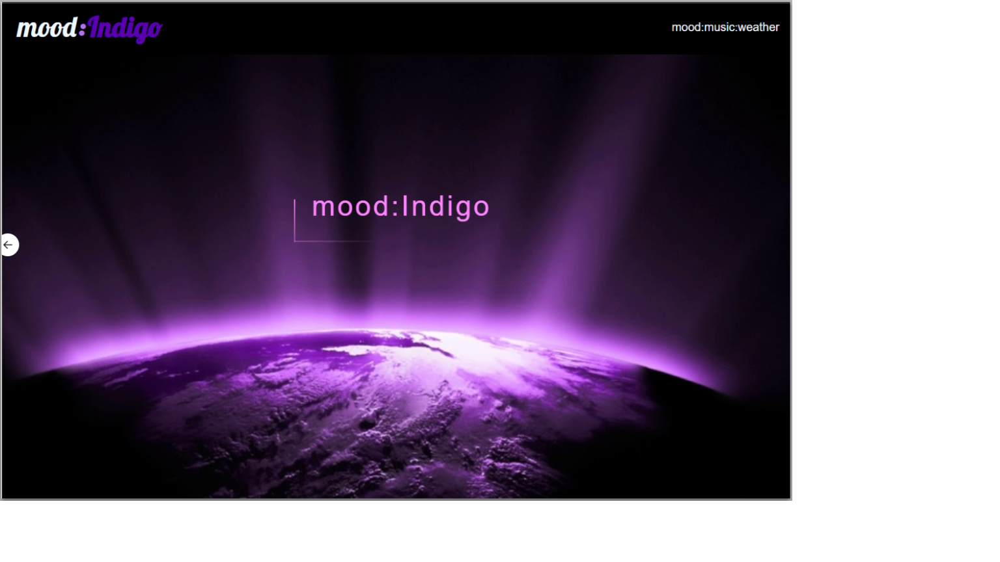

# Mood Indigo
Project #1 – Team 5
Trilogy – Full Stack Development Program University of Washington Cohort 2020

Team Members:
Evan Pacholski

Kyle Anderson

Anthony Perez

Hannibal Wyman

Project Description:

Mood Indigo 

Music, Mood, and Weather application -

As a user, when I visit this page, I want to quickly and easily access a playlist that is generated based on the weather outside and my current mood. 

Mood Indigo is a mobile first app that connects the users emotions with suggestable playlist through Spotify based on the users local weather. The application utilizes the Spotify API to generate random playlist, ip-API to gather general geo-location, and Open Weather API to pull user local weather info.
 

Key Elements & Features:

Musical and Emotional Enjoyment

Motivation:

Listen to music that fits the users mood.

Tech/framework used:

HTML, CSS, JavaScript, JQuery, AJAX, Foundation

New Technology used:

Animate.css, CodePen.css
API Reference:

Spotify

Open Weather Map

ip-API

Copyright:
Kyle Anderson, Anthony Perez, Hannibal Wyman, Evan Pacholski

© 2020 All Rights Reserved
